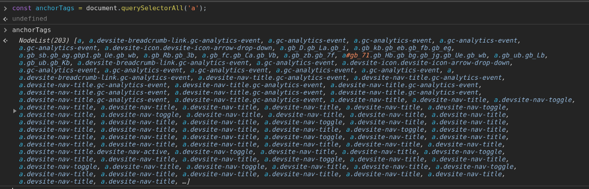
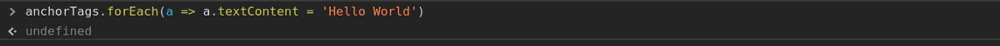
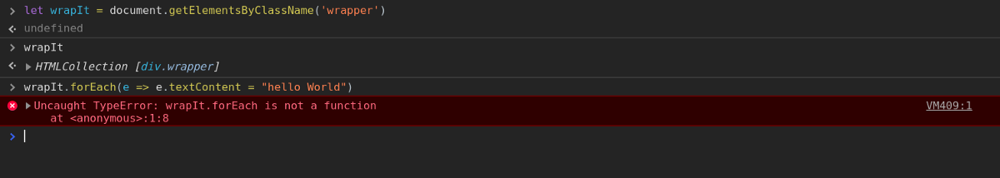
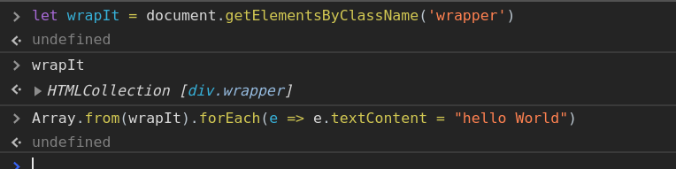

_Let’s play with these a little._

_I am going to be very specific here, we are not going to discuss some bookish definitions here like what is Array or DOM, it’s better to refer_ [_mdn_](https://developer.mozilla.org/en-US/docs/Web/API/Document_Object_Model) _or Wikipedia for it. Better let’s code and understand._

Writing about DOM is kind of little cliche now. So, I decided to go with an interesting part, with which beginners struggle a bit when they start learning DOM. Personally, I found it tough to understand the difference between these three.

We can see here using querySelectorAll returns a NodeList.

Can we put forEach method on NodeList ??.. Let’s see!!

As we can see we aren’t getting any error, so yes we can put forEach method on NodeList. Can we do the same with HTML collection ?? Let’s try!!

Nope. We can’t. We got an error. So, what should we do? Yup, you are right we should convert it into an array first. So, Let’s try this after converting it to an array.

We didn’t get any error, which means, yes we can convert it to an array and then put forEach method on it.

So, here comes two more questions:-

**Q1. Which are the selectors which give us NodeList and which selectors give HTML Collection?**

**Q2. Which one we should use during DOM manipulation?**

Let’s start from our very first question which is :-

### What’s the difference between an Array, NodeList and HTML collection?

HTML collection and NodeList are both special kinds of objects similar to an Array. All three have different methods to access their data, but yes, they do have few things in common like arranging data according to their indexes.

There are **5** ways in which we can select elements in a DOM using selectors.

1.  **getElementsByTagName( )**

➡️ it returns a HTML collection.

**2\. getElementsByClassName( )**

➡️ it returns a HTML collection

**3\. getElementById( )**

➡️ it returns a first element having the id which we specified.

**4\. querySelector( )**

➡️ it also returns a first element but gives us a freedom of searching element by className, id or tagName.

**5\. querySelectorAll( );**

➡️ it returns the nodeList of all elements which we specify in the selector and yes, even this selector gives us the freedom of searching by className, id or tagName.

The one which I use most is document.querySelector( ) because it returns a single element and gives us the freedom to search in different categories.

In case I want a full collection, I prefer document.querySelectorAll( ) because it returns a nodeList which makes it easy to put forEach method, without converting them to an Array.

_It's one’s personal choice and demand of the situation which helps to choose which selector a person should use._

Hope, this article gave you some useful information.
