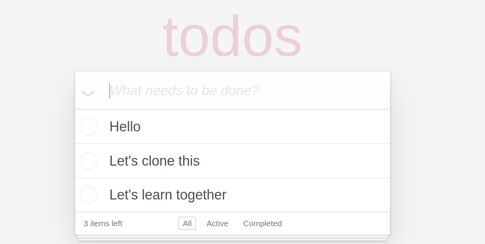
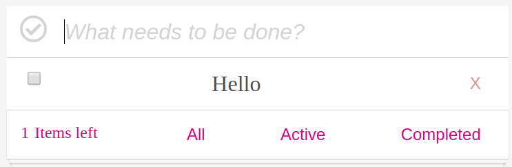
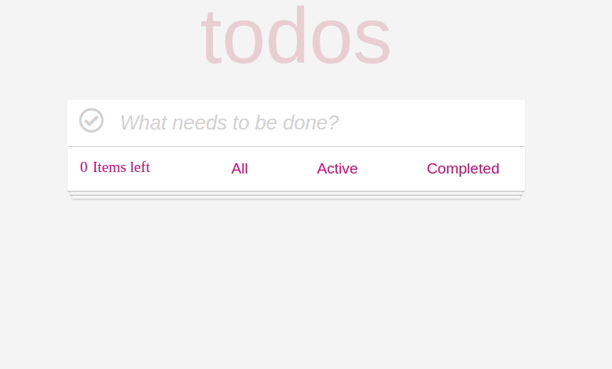
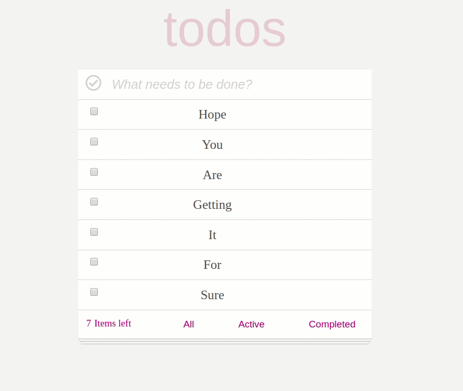

> _Step by step guide to creating a fully functional todo app using just HTML, CSS and JavaScript_

Have a look at what we gonna make.

[**vanilla \* TodoMVC**  
todomvc.com](http://todomvc.com/examples/vanillajs/ "http://todomvc.com/examples/vanillajs/")[](http://todomvc.com/examples/vanillajs/)

Yes, we are going to clone this and I m going to teach step by step without skipping any.



I will advise you to get the **starter pack** in which I have already done the basic HTML and CSS, so that we can directly learn how to make it functional.

[**puneettiwari61/lets-make-todo**  
_You can’t perform that action at this time. You signed in with another tab or window. You signed out in another tab or…_github.com](https://github.com/puneettiwari61/lets-make-todo "https://github.com/puneettiwari61/lets-make-todo")[](https://github.com/puneettiwari61/lets-make-todo)

So, without wasting any time. Let’s start.

### Understanding the approach.

We are going to apply the concept of [classes](https://javascript.info/class). We are going to take a class with the name TODOS, we don’t need arguments in constructor.

Declare a class

In terms of data, we need an empty array in which we gonna keep our every single todo as an object. We kept its name as todo.

If you are confused about why we took [**this**](https://javascript.info/object-methods)  on the left side of todo.

We will be needing two methods here, one to _addTodo_ and one will be rendered_._

Let’s see how these two methods will us in making our todo.

In _addTodo,_ we will create an object with todo details like the text of todo, is it completed or have to complete in boolean and unique id to each of our todos. As we can see below

addTodo method

And in _render_ method, we gonna create our dom elements which we will be displaying.

render method

Let’s go line by line of it to understand the _render_ method.

```
Whenever we will invoke render method, there will be some li in ul , so everytime we render we have to clear the innerHTML of ul in order not to get same todo again and again many times.
```

After clearing ul, the next step is to put a forEach loop on the todo which we have taken as an array. Whenever we gonna add any todo, there will be a set of steps which will happen which includes the creation of a new ‘li’, ‘input’, ‘paragraph’ and a ‘button’ element.

```
As we can see in above pic 
'li' contains 'input' type checkbox, a 'p' which is actually a paragraph, and 'deleteit' a button with a text content of X.

so, as it is in forEach loop , it gonna create every single time, whenever we will call render.

And offcourse yes we gonna invoke render after adding each todo.
```

_input_ will be checked or not, it gonna take its value from todo property which is completed as it is in boolean, by default we are setting it to false.

-   \* Important thing to notice and understand is that we are adding an attribute of data-key to ‘input’ and ‘delete’ element which is equal to the ‘id’ property of our todo.

And to reflect everything in the display we are appending ‘input’, ‘p’, and ‘delete’ elements in ‘li’ and then appending ‘li’ in ul.

Its time to create an object with the help of _new_ keyword.

```
let newtodo = new Todos;

*newtodo is our brand new object with an empty array of key todo.
```

Let’s add our first functionality to our app of adding todo after pressing enter.

First, let’s select our few important elements by using a query selector.

I have selected all the important elements which we gonna need in our code.

### **Adding a Todo, First functionality**

```
First step is to subscribing our main input box with an event listener of 'keyup' event and adding a callBack function enterTodo

In enterTodo function , we are only concern about 'enter' key event.
Whenever user will press enter we are calling our method which we created earlier i.e. addTodo.
```

-   _addTodo_ method will create an object with name, completed and id property.
-   _name_ is going to be the text, that will user will enter in the main Input box.
-   _completed_ is gonna be false in starting.
-   _id_ we are going to get by calling our random id generator function.

```
function randomGen(str = 'qwertyuio') {

return str.split('')

.sort(() => Math.random() - 0.5)

.join('') + '_' + Math.floor(Math.random() * 1000)

}

In case you are wondering about it, this is how we can  make our random id generator.


```

-   As soon as user will press enter, this new object will concatenate with our already existing array i.e. todo.
-   The final step is to call the render method in order to reflect this in our display.
-   Obviously you too can add a localStorage, the way I added.

**Wooooooooooooooooooooooo!!!!!!!!!!!!!**

Just now we have completed the first main functionality of our todo app.

Let’s move to the next step.

### Deleting a Todo, Second functionality

```
First step gonna be is to subscribe a 'click' event to the deleteit button, with a callBack function deleteTodo.
```

-   Whenever the user will click on _deleteit_ button, it will send an event to our callBack _deleteTodo_, we are just interested in the target of the event.
-   In _deleteTodo_ we are putting a filter on our array which will give us a new array only of those todos which do not have the same ‘id’ property as the dataset key of ‘deleteit’ button on which user clicked.
-   And then replacing our old array with the obtained new array.
-   Definitely we gonna render this new object again by invoking newtodo.render(ul).
-   yeah, we should add local storage here too.

```
***Important thing to keep in mind while writing deleting functionality, we should call our 
deleteit.addEventListener(‘click’, deleteTodo)
function inside our render method , even inside forEach method which is already in render.
***
```

**Woooooooooooouuuuuuuu!!!!!!!!**

Delete a todo functionality is also done.

Let’s move to next functionality

### After completing a task, marking todo as finished

**This is our third and one of the most important functionality**

```
Here, our first step gonna be is to subscribe a 'click' event to the checbox, which we named as input, with a callBack function toggle.
```

-   Whenever the user will click on a checkbox, it will send an event to our _toggle_ function.
-   In _toggle,_ we are putting a map on our array with a condition that if the dataset key of the target is equal to the ‘id’ property of todo, then it will change its completed property to the opposite of what it is already.
-   If it is true, we will make it false and vice-versa.
-   At the same time, we gonna replace our old array by our newly obtained array.
-   And rendering it by calling our render method and updating local storage is mandatory.

```
***Its imporatnt to call this function inside our forEach method which is already inside our rendor method.
```

To keep our checkbox always update, whenever we will refresh, do not forget to add this in our render method

hurrrrayyyyyyyyyy!!!!!!

We have completed our three main functionalities of the todo app.

Let’s add a few more features to it.

### Items left, fourth functionality

This is not exactly a function but its gonna be a feature of our todo app, it will show us no. of items lefts which we didn’t mark completed.



Have a look at the above image, this is what we gonna do and yes, I have already done all the styling part and gave the link in starting of article.

Believe me, this is going to be very simple. We just have to keep updating it with the length of the array including only those which have completed property as false.

Yes, using the filter method will be a good idea.

Let’s do it.

Yes, the code is really small, just put a filter get the length and update it.

```
***Dont forget to invoke the function in rendor method.


```

Yes, even the fourth functionality is done, let’s see three more functionalities.



From the above image, it's easy to understand our next three functionalities.

### Active Button

Whenever the user will click on the active button. It will only show him only those todos which are not marked as completed.

-   At first, we have to subscribe to the Active button to click event.
-   Clicking on the Active button will trigger _activeFunc._
-   In _activeFunc_ function, we are creating a new object called newtodoActive with the help constructor function TODOS.
-   This new object will only consist of todos which aren’t marked as completed.
-   As in the above image using the filter method we are obtaining our new array.
-   And yes the final step is to call render method on the new object.
-   Yes, it was that simple.

### All Button

This button simply gonna show the list of all todos. No efforts needed, just to subscribe it with click event and then to call render method on the object.

```
const allFunc = function(event){

newtodo.render(ul);

}

all.addEventListener('click', allFunc);

yes this much easy :)
```

**Completed Button**

This will do the exact opposite of the Active button.

-   When users will click on the Completed button, it will invoke _completedFunc_.
-   We gonna create new object i.e. newtodoCompleted with the help of constructor function TODOS.
-   Which will only consist of an array of todos which are marked as completed.
-   Yes, the next step is to render our new object.

**That's it, Our fully functional todo is ready to go live :)**

I m putting my whole js code here, in case anyone needs it.

Hope, It will help.

Though there are still many more features we can add in todo app, I am leaving this on your creativity :)
