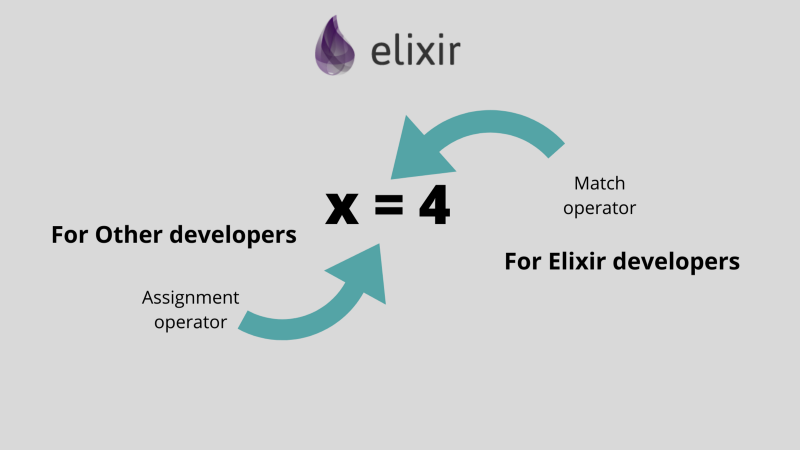

**_Learning Elixir_** _is not just about learning its syntax, it gives a whole new way of thinking._

I expect most of you are coming from different backgrounds and learning **Elixir** as your second or third programming language. If you are learning it as your first programming language believe me ‘**you are the chosen one!** 😄’. I am a little biased here, and I think I will always be, for me Elixir was love at first sight.

It’s really interesting how a language which runs on the **Erlang** VM is an extremely fun and easy-to-use programming language. Developers generally avoid learning **Erlang** unless required  as it is one of the toughest programming languages. But _Writing Elixir is a joy,_ you can write programs that are easy-to-understand for humans and computers alike.

Unlike other programming languages, the equals(=) sign is not an assignment. Instead, it’s like an assertion. It succeeds if Elixir can find a way of making the left-hand side equal the right-hand side. Elixir calls the = symbol the match operator.

Let’s see some examples of **Pattern Matching —**

Match Operator

Let’s use the interactive Elixir shell. We can argue in the first line that we are assigning a value 5 to variable b.

But as we move to the next line we can see executing `5 = b` , is not an error which is actually an error in many programming languages.

In the third line executing `10 = b` is actually an error, the one and only reason for the error is that there is no matching value of 10 on the right-hand side because b is actually equals to 5. So, here argument comes to an end that it may look like an assignment operator but behaves in a totally different way. That’s called match operator.

-   **\*one thing to keep in mind is that a variable can only be assigned on the left side of** `**=**`** .**

Let’s do a complex match, comparing different types —

Pattern Matching

Let’s analyse above commands —

-   In the first line, we are assigning `[1,2,3]` to a variable `list.`
-   The second command is actually matching both the sides and assigning values `a = 1 , b = 2, c = 3` .

If you are from the **Javascript** background like me, when we do similar things there we call them **Destructuring**. But believe me its way ahead than that. Let me show you how.

Head and Tail

Now let’s analyse this one

-   the first value of the list`[1,2,3]` i.e. 1 will get assign to head variable.
-   Rest all will assign to variable tail in list format.

> Pattern matching allows developers to easily destructure data types such as tuples and lists.

Now let’s see something more interesting **Variables in Elixir can be rebound:**

#### The pin operator —

^ Pin Operator

-   Assigning 1 to b, seems fine.
-   Assigning 2 to b, even this is cool.
-   In third command matching b and 2, both have the same value so its a match.
-   But here comes the pin operator `^` , now it's an error.

It's an error because pin operator binds the last assigned value of variable and matches against it rather than assigning a new value to it.

_Use the pin operator_ `_^_` _when you want to pattern match against an existing variable’s value rather than rebinding the variable_

#### Its time to meet special variable of Elixir i.e. underscore ( `_ )`

Yes, it is, underscore `_` is really a special variable, it acts as a variable but immediately discards any value given to it — in a pattern match, it is like a wildcard saying, “I’ll accept any value here.” Isn’t it awesome!!

Underscore variable

-   In the first line, we are comparing both sides.
-   `a` gets a value of 1
-   `2,3` gets assign to underscore variable which accepts any value
-   So basically, with the help of underscore variable, we ignored the values which we don’t require.
-   In the last line, we tried to read the value of the underscore variable which thrown an error.

The variable `_` is special in that it can never be read from. Trying to read from it gives a compile error.

I think now you have a better understanding of how pattern matching works and what it is. **This finishes our topic pattern matching.**

As always, thanks for reading😊.
