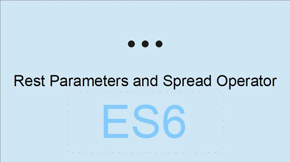

Javascript, arguably one of the most important **languages** of today, and tomorrow. It's still evolving, ECMA6 came out with some cool new features; `...` is one of these new Javascript functionalities. It can be used in two different ways; as a `spread operator` OR as a `rest parameter`.

**Both rest parameter and spread operator are kinda opposite to each other.**

Rest parameter is used to collect elements into an array, while, Spread operator is used to spread the items of an array into single elements.

Let’s not waste much time in definitions, let’s code and see how these actually work.

Suppose we have a function like this.

A function which can take any no. of arguments, the first arguments will always be a multiplier and rest will be numbers which will get multiplied by a multiplier.

As we can see above three dots before ‘theArgs’, Here these three dots represent rest operator, and this means that all the remaining arguments apart from multiplier will get collected in the array named ‘theArgs’.

_Since ‘theArgs’ is an array, so we are putting the map method on it._

And we are storing the new output array in variable ‘arr’.

In this case, 2 is a multiplier and rest arguments will get collected in ‘theArgs’ array.

```
theArgs = [1,2,3];
```

and yes the new returned array from the function multiplyby will be in ‘arr’.

```
arr = [2,4,6] //output
```

So, for rest parameter, **the dots literally mean “gather the remaining parameters into an array”.**

Hope, it must have given some clarity.

### Let’s see the Spread operator.

We have seen how to gather parameters into an array, but sometimes we have to do the exact opposite, that’s where we need spread operator.

Few important use cases of spread operator.

**Adding the elements of an existing array into a new array**

Yes, the spread operator can do this work very easily. As we can see in the above example. Without writing the values of ‘certsToAdd’ just putting three dots(…), with array name, we can easily add its elements to a new array.

So, as its name suggests, it is spreading the elements of ‘certsToAdd’ in ‘certifications’.

**Passing the elements of an array as arguments to a function.**

Suppose we have a function as above which takes three parameters and console log their sum.

And we have an array of three numbers, but passing its elements to the function can make us write one or two extra lines of code, here, spread operator is doing this for us just by three dots(…).

```
as we will pass (...args) as an parameter to the function, it will spread its elements into a list of arguments.  
```

**To copy Array**

Copying array is not any difficult task, but the spread operator gives us an advantage, as sometimes we don’t want to copy it by reference.

Yes, in above example we are copying ‘arr’ in ‘arr2’ but as we are using spread operator, its spreading ‘arr’ elements in ‘arr2’ which is not copying by reference, it is actually copying by value.

Hope my work must have helped in understanding rest operator and spread operator :)
